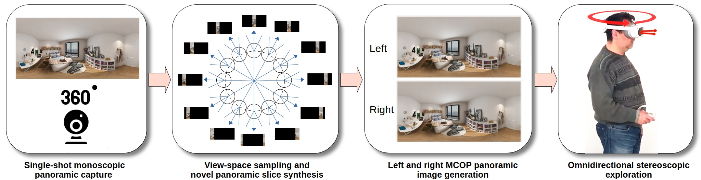

# PanoVerseStereo
Implementation of the WEB3D 2023 paper: PanoVerse: automatic generation of stereoscopic environments from single indoor panoramic images for Metaverse applications  

This paper received the honorable mention award in the best paper category at Web3D 2023.

This work introduces an innovative approach to automatically generate and explore immersive stereoscopic indoor environments derived from a single monoscopic panoramic image in an equirectangular format. Once per 360 shot, we estimate the per-pixel depth using a gated deep network architecture. Subsequently, we synthesize a collection of panoramic slices through reprojection and view-synthesis employing deep learning. These slices are distributed around the central viewpoint, with each slice’s projection center placed on the circular path covered by the eyes during a head rotation. Furthermore, each slice encompasses an angular extent sufficient to accommodate the potential gaze directions of both the left and right eye and to provide context for reconstruction. For fast display, a stereoscopic multiple-center-of-projection stereo pair in equirectangular format is composed by suitably blending the precomputed slices. At run-time, the pair is loaded in a lightweight WebXR viewer that responds to head rotations, offering both motion and stereo cues. The approach combines and extends state-of-the-art data-driven techniques, incorporating several innovations. Notably, a gated architecture is introduced for panoramic monocular depth estimation. Leveraging the predicted depth, the same gated architecture is then applied to the re-projection of visible pixels, facilitating the inpainting of occluded and disoccluded regions by incorporating a mixed Generative Adversarial Network (GAN). The resulting system works on a variety of available VR headsets and can serve as a base component for a variety of immersive applications. We demonstrate our technology on several indoor scenes from publicly available data.

This repo is an extended and work-in-progress code release of the original paper for demo purpose.

**Method Pipeline overview**:

## Updates
* 2024-1-11: First release including views composer script 
  
## Python Requirements
- Python >=3.6
- pytorch>=1.0.1
- torchvision
- numpy
- Pillow
- scikit_learn
- tqdm
- scipy
- Shapely
- thop

  ## Other Requirements
  - TO DO

